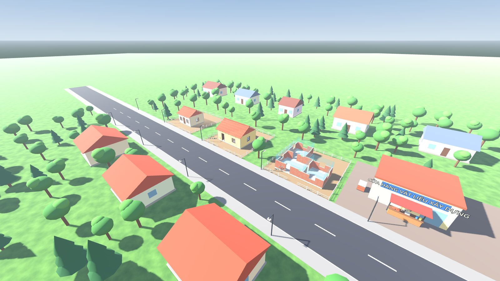
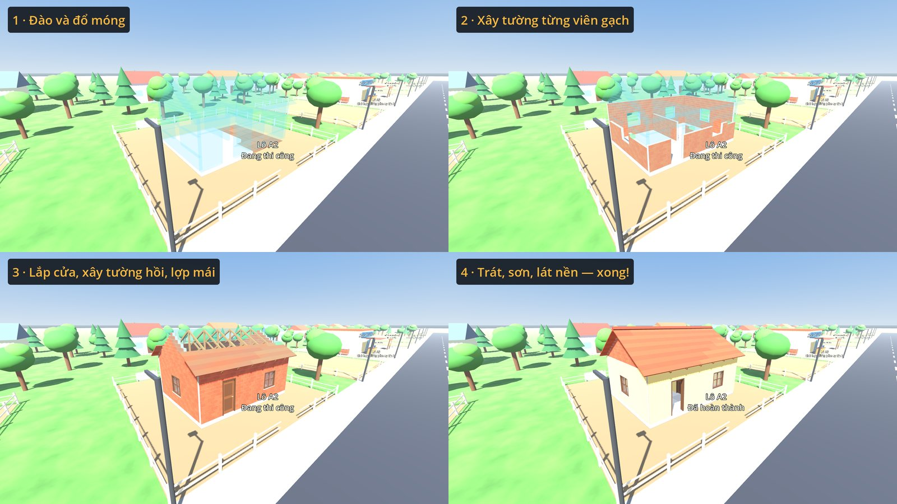
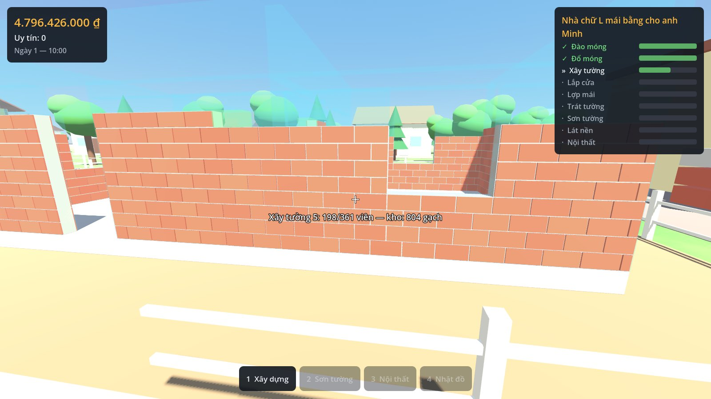
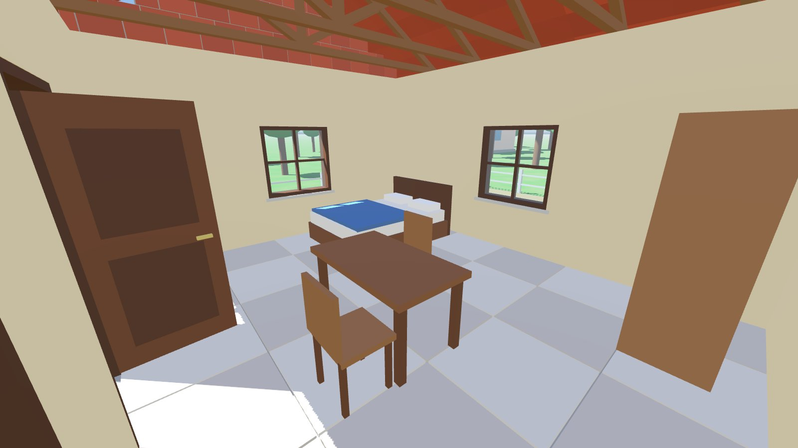
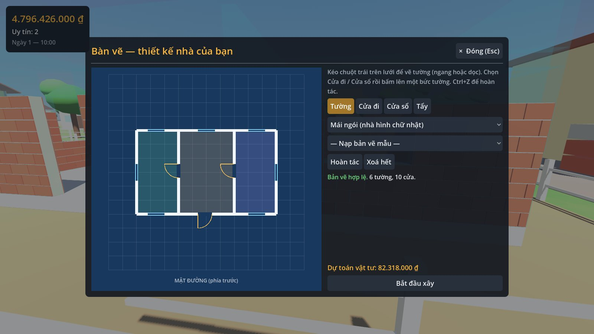
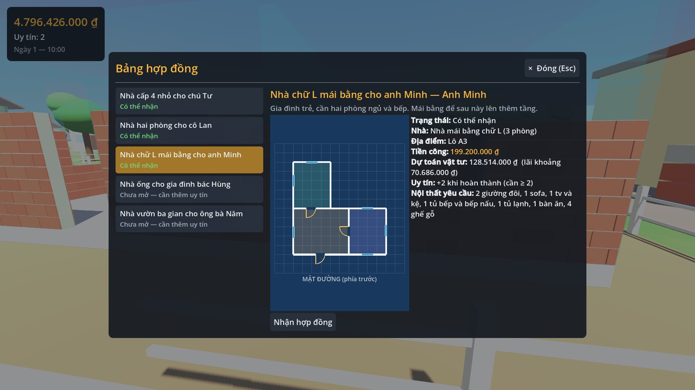

# Builder Simulator — game giả lập xây nhà (Godot 4)

Game góc nhìn thứ nhất, thế giới mở: nhận hợp đồng → mua vật tư → đào móng, đổ móng → xây tường
**từng viên gạch** → lắp cửa → xây tường hồi, lợp mái → trát, sơn → lát nền → bày nội thất →
nghiệm thu nhận tiền. Có bàn vẽ để tự thiết kế và xây nhà riêng.





| Đang xây (HUD, gợi ý thao tác, checklist) | Nội thất |
|---|---|
|  |  |
| **Bàn vẽ nhà riêng** | **Bảng hợp đồng** |
|  |  |

## Trong game đã có

- **Thế giới mở**: thị trấn có đường, vỉa hè, đèn đường, cây, nhà dân; cửa hàng vật liệu, bảng hợp đồng;
  6 lô đất nhận thầu và đất nhà bạn; ngày và đêm.
- **Thi công 9 giai đoạn** theo đồ thị phụ thuộc: đào móng, đổ móng, xây tường (gạch xếp so le, mối nối
  góc chữ L/T), lắp cửa đi/cửa sổ, mái ngói (tường hồi, vì kèo, ngói, ngói nóc) hoặc mái bằng, trát, sơn
  (8 màu), lát nền, nội thất (16 món, xoay 90°, không đặt chồng, không chắn cửa đi).
- **Kinh tế**: tiền, kho, mua/bán lại 70%, "mua đủ cho công trình", dự toán, tiền công, uy tín mở dần
  5 hợp đồng với 5 mẫu nhà.
- **Bàn vẽ**: vẽ tường trên lưới, đặt cửa, tẩy, hoàn tác, kiểm tra hợp lệ trực tiếp (tìm phòng bằng BFS,
  phòng nào cũng phải có cửa vào), dự toán, rồi xây trên đất nhà bạn.
- **Lưu/tải** JSON an toàn: 3 ô lưu, lưu nhanh F5/F9, tự lưu 5 phút.
- **144 bài test tự động**, gồm bài nghiệm thu chơi trọn một hợp đồng như người thật
  (nhắm camera và bấm chuột ~1.500 lần), rồi lưu/tải và so sánh.

**Phần của bạn: nhân vật.** Hiện có một nhân vật tạm (hình con nhộng + camera) để chơi thử.
Giao kèo và hướng dẫn tự làm từng bước: [`docs/08-nhan-vat.md`](docs/08-nhan-vat.md).

## Chạy game trên Windows

1. Tải **Godot 4.7.2 bản thường** (không phải bản .NET/mono) ở trang phát hành chính thức:
   <https://github.com/godotengine/godot/releases/tag/4.7.2-stable> → file `Godot_v4.7.2-stable_win64.exe.zip`.
2. *(Nên làm — thói quen bảo mật)* Kiểm tra file tải về không bị sửa. Mở PowerShell ở thư mục chứa file:

   ```powershell
   (Get-FileHash .\Godot_v4.7.2-stable_win64.exe.zip -Algorithm SHA512).Hash.ToLower()
   ```

   Kết quả phải **giống hệt** dòng của file này trong `SHA512-SUMS.txt` (cùng trang phát hành):
   `83decd58fdf67b9d657958a1ae6bf1929c20785315a81effe245874cdc57acb709bf868e00778a96984338c1b29dafdb453c6847747694621c6ecf5da2259993`
3. Giải nén, ví dụ vào `C:\Tools\Godot\`. Bên trong có 2 file: `Godot_v4.7.2-stable_win64.exe` (mở editor)
   và `Godot_v4.7.2-stable_win64_console.exe` (kèm cửa sổ dòng lệnh — dùng để chạy test).
4. Lấy mã nguồn (PowerShell):

   ```powershell
   cd $HOME\Documents
   git clone https://github.com/duahnproducts/builder_simulator.git
   cd builder_simulator
   git checkout claude/practical-bell-urj7hc   # nhánh đang phát triển, khi chưa gộp vào main
   ```

5. Mở `Godot_v4.7.2-stable_win64.exe`. Trong Project Manager bấm **Import**, chọn file `project.godot`
   trong thư mục vừa clone, rồi xác nhận để mở dự án. Lần đầu Godot mất vài giây để nhập tài nguyên.
6. Bấm **F5** (Run Project) để chơi. Bắt đầu bằng cách đi tới bảng hợp đồng trước mặt và bấm **E**.

## Điều khiển

| Phím | Tác dụng |
|---|---|
| W A S D | Đi lại (Shift chạy, Space nhảy) |
| Chuột | Nhìn |
| Chuột trái | Làm việc đang nhắm; **giữ** để làm liên tục (chỉ lặp đúng một loại việc) |
| 1 · 2 · 3 · 4 | Chế độ: Xây dựng · Sơn tường · Nội thất · Nhặt đồ |
| Lăn chuột / Q · Z | Đổi màu sơn / món nội thất |
| R | Xoay món nội thất 90° |
| E | Tương tác: mở/đóng cửa, cửa hàng, bảng hợp đồng, bàn vẽ |
| B · J · P | Cửa hàng · Hợp đồng · Bàn vẽ |
| Esc | Đóng bảng đang mở / Menu tạm dừng (lưu, tải, ván mới) |
| F5 · F9 | Lưu nhanh · Tải nhanh |
| F1 | Bật/tắt bảng hướng dẫn |

## Chạy test (PowerShell)

```powershell
cd $HOME\Documents\builder_simulator
$godot = "C:\Tools\Godot\Godot_v4.7.2-stable_win64_console.exe"
& $godot --headless --import --path .                  # cập nhật danh sách class (cần sau khi thêm script mới)
& $godot --headless --path . res://tests/runner.tscn   # chạy toàn bộ test
$LASTEXITCODE                                          # 0 = đạt hết
```

- Dòng cuối mong đợi: `Kết quả: 144 đạt, 0 hỏng (… giây)`.
- Chỉ chạy test có tên chứa một chuỗi: thêm `++ --filter=save` vào cuối lệnh thứ hai
  (dùng `++` thay cho `--` vì PowerShell có thể nuốt mất `--`).
- Báo `The term ... is not recognized`: kiểm tra lại đường dẫn bằng `Test-Path $godot`.
- Trên Linux: `tools/install_godot.sh` rồi `tools/run_tests.sh` (hoặc `tools/lint.sh`: coi mọi cảnh báo là lỗi).

## Cấu trúc dự án

```
data/        vật phẩm, hợp đồng, bản vẽ mẫu, lô đất (JSON — sửa để cân bằng game)
docs/        phương án kỹ thuật từng tính năng (đọc trước khi sửa code)
scenes/      scene chính main.tscn và nhân vật tạm
scripts/     core/ (luật chơi, test được) · building/ (hiển thị 3D) · player/ (điều khiển)
             world/ (thị trấn) · ui/ (giao diện) · autoload/ (trạng thái chung, lưu game)
tests/       unit/ · integration/ · acceptance/ + bộ chạy test tự viết
tools/       cài Godot, chạy test, lint, chụp ảnh (tools/capture/)
```

## Tài liệu kỹ thuật

| Tài liệu | Nội dung |
|---|---|
| [`00-tong-quan.md`](docs/00-tong-quan.md) | Kiến trúc theo lớp, quy ước, vì sao chọn Godot |
| [`01-ban-ve.md`](docs/01-ban-ve.md) | Bản vẽ, kiểm tra hợp lệ, tìm phòng bằng BFS |
| [`02-xay-tuong.md`](docs/02-xay-tuong.md) | Bố cục gạch, mối nối góc, lỗ cửa, gộp va chạm |
| [`03-mong-mai-nen.md`](docs/03-mong-mai-nen.md) | Móng, mái ngói/mái bằng, tường hồi, lát nền |
| [`04-thi-cong.md`](docs/04-thi-cong.md) | Giai đoạn thi công (DAG, thuật toán Kahn), vật tư, nội thất |
| [`05-kinh-te-hop-dong.md`](docs/05-kinh-te-hop-dong.md) | Tiền, kho, cửa hàng, hợp đồng |
| [`06-luu-game.md`](docs/06-luu-game.md) | Lưu/tải JSON, phiên bản, **an toàn** (file lưu là dữ liệu không đáng tin) |
| [`07-the-gioi.md`](docs/07-the-gioi.md) | Thị trấn, lô đất, ngày đêm |
| [`08-nhan-vat.md`](docs/08-nhan-vat.md) | Giao kèo cho nhân vật — phần của bạn |
| [`09-giao-dien.md`](docs/09-giao-dien.md) | HUD, các bảng, phím điều khiển |

## Ghi chú

- Renderer đang dùng: **Compatibility** (OpenGL 3.3) — chạy trên mọi máy và là renderer duy nhất kiểm thử
  được tự động. Máy có card rời (ví dụ RTX 4050) có thể thử *Project Settings → Rendering → Renderer →
  Forward+* cho ánh sáng đẹp hơn (chưa được kiểm thử tự động).
- Ảnh trong README được chụp tự động từ game bằng `tools/capture/capture_readme.gd`.
- Quy định làm việc với Claude trong dự án: [`CLAUDE.md`](CLAUDE.md).
